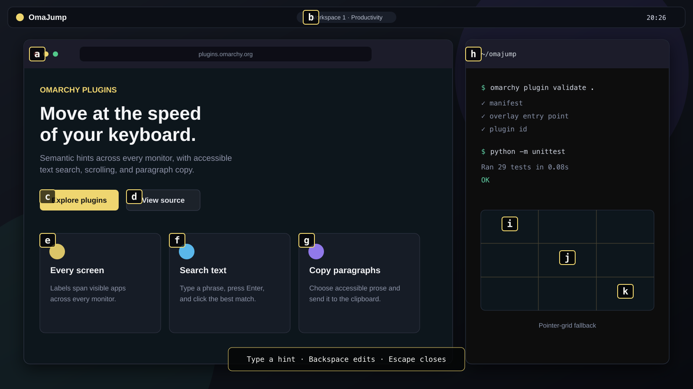

# OmaJump

Keyboard-first navigation for Omarchy.



OmaJump places short, alphabetical hints over controls on every connected
screen. Type a hint to activate a control, search visible text, choose an exact
scroll region, or copy a paragraph—without reaching for the mouse.

It is an Omarchy 4 overlay plugin built with Quickshell, Python, Hyprland, and
AT-SPI. It works with native applications as well as Chromium and Electron
apps, and includes a pointer-grid fallback for windows with limited
accessibility support.

## Features

- Hints across every monitor and every visible window on its active workspace
- Semantic activation through each control's accessibility action
- Native hints for clickable Omarchy toolbar widgets
- Live text search with a clearly selected Enter target
- Selectable scroll regions, including whole-window terminal fallback
- Hint-driven copying of accessible paragraphs
- Three-level pointer grid for apps that expose no actionable controls
- Mixed-DPI and fractional-scale coordinate mapping
- Theme-aware styling with high-contrast, 70%-opaque black hint badges
- Prefix-free labels: a complete hint always activates immediately

OmaJump does not use screenshots, OCR, a network connection, root access, or a
virtual input device.

## Install

Install and enable the plugin directly from GitHub:

```bash
omarchy plugin add https://github.com/belogermanotta/omajump.git --enable
```

Add the shortcuts below to `~/.config/hypr/bindings.lua`:

```lua
o.bind("SUPER + ALT + CTRL + SPACE", "OmaJump", "omarchy-shell shell toggle io.github.belogermanotta.omajump '{}'")
o.bind("SUPER + ALT + CTRL + SLASH", "OmaJump text search", "omarchy-shell shell summon io.github.belogermanotta.omajump '{\"mode\":\"search\"}'")
o.bind("SUPER + ALT + CTRL + J", "OmaJump scroll regions", "omarchy-shell shell summon io.github.belogermanotta.omajump '{\"mode\":\"scroll\"}'")
o.bind("SUPER + ALT + CTRL + P", "OmaJump copy paragraph", "omarchy-shell shell summon io.github.belogermanotta.omajump '{\"mode\":\"paragraph\"}'")
```

Check for conflicts before adding them:

```bash
omarchy menu keybindings --print
```

Then reload and validate Hyprland:

```bash
hyprctl reload
hyprctl configerrors
```

Installation does not edit your Hyprland configuration automatically.

## Shortcuts

| Shortcut | Mode | What it does |
| --- | --- | --- |
| <kbd>Super</kbd> + <kbd>Alt</kbd> + <kbd>Ctrl</kbd> + <kbd>Space</kbd> | Controls | Labels actionable controls, toolbar widgets, and fallback windows |
| <kbd>Super</kbd> + <kbd>Alt</kbd> + <kbd>Ctrl</kbd> + <kbd>/</kbd> | Search | Highlights accessible text after three characters |
| <kbd>Super</kbd> + <kbd>Alt</kbd> + <kbd>Ctrl</kbd> + <kbd>J</kbd> | Scroll | Labels scrollable regions and windows |
| <kbd>Super</kbd> + <kbd>Alt</kbd> + <kbd>Ctrl</kbd> + <kbd>P</kbd> | Paragraphs | Labels prose blocks and copies the selected paragraph |

OmaJump opens an overlay on every connected display. The monitor that was
focused when the overlay opened owns keyboard input, while hints remain visible
and selectable everywhere.

### Control hints

Type the label displayed over a control. Labels begin with `a`, `b`, `c`, and
continue alphabetically. When more labels are needed, later letters expand into
prefix-free multi-letter combinations. Already-typed characters turn grey so
the remaining keys are easy to see.

- <kbd>Backspace</kbd> removes the last typed character.
- <kbd>Escape</kbd> closes OmaJump.
- A complete label activates immediately.

Targets are ordered by monitor, then from top to bottom and left to right.

### Text search

Open search mode and type at least three characters. Matching accessible text
is highlighted on every screen and narrows as you continue typing.

- The best match receives a blue outline.
- <kbd>Enter</kbd> clicks the blue-outlined match.
- Exact matches rank above prefix matches, followed by substring matches.
- <kbd>Backspace</kbd> broadens the results; <kbd>Escape</kbd> closes the overlay.

Search uses accessible text only. It does not OCR pixels or inspect screenshots.

### Scroll regions

Choose the hint over the region you want to control, then use:

- <kbd>Up</kbd> or <kbd>I</kbd> to scroll up
- <kbd>Down</kbd> or <kbd>K</kbd> to scroll down
- <kbd>Backspace</kbd> to choose another region
- <kbd>Escape</kbd> to close

OmaJump sends Page Up/Page Down to the exact selected window. Common terminals,
including WezTerm, Kitty, Alacritty, Foot, and Ghostty, automatically use their
Shift+Page Up/Page Down scrollback shortcuts.

### Copy a paragraph

Paragraph mode labels prose blocks exposed by the accessibility tree. Choose a
label and OmaJump copies the complete selected text to the Wayland clipboard
with `wl-copy`.

Chromium and Electron often expose prose as static text instead of using the
formal paragraph role. OmaJump recognizes those blocks while filtering short
labels, controls, and truncated list titles.

### Pointer-grid fallback

Some apps—terminals, games, canvases, remote desktops, and custom UI
toolkits—may expose few or no actionable controls. In control mode, OmaJump
places a hint at the center of an unsupported window:

1. Choose the window hint.
2. Choose a cell in the highlighted 3×3 grid.
3. Repeat for three levels of precision.
4. OmaJump moves the pointer and sends a left click to that exact window.

<kbd>Backspace</kbd> returns to the previous grid level. This fallback uses
Hyprland's native dispatchers; it does not synthesize input through a virtual
device.

## Requirements

- Omarchy 4 with `omarchy-shell`
- Hyprland and Quickshell
- Python 3
- PyGObject with the AT-SPI 2 introspection bindings
- `wl-clipboard` for paragraph copying

These are available in a standard Omarchy 4 installation. Results still depend
on what each application publishes through AT-SPI. Native GTK apps generally
provide rich semantic trees. Chromium and Electron accessibility trees are
requested automatically when OmaJump opens. Pure GPU surfaces may need the
pointer-grid fallback.

## Troubleshooting

### No controls are found

The focused application may not expose actionable AT-SPI controls. Try control
mode again after the app has fully loaded. If the window still has no semantic
targets, OmaJump should offer its centered pointer-grid hint.

Run a read-only probe to see what the backend discovers:

```bash
python ~/.config/omarchy/plugins/io.github.belogermanotta.omajump/scripts/omajump_backend.py --probe \
  | python -m json.tool
```

### The overlay does not open

Validate the installed plugin and restart the shell:

```bash
omarchy plugin validate ~/.config/omarchy/plugins/io.github.belogermanotta.omajump
omarchy restart shell
```

Also confirm that Hyprland accepted the binding:

```bash
hyprctl configerrors
omarchy menu keybindings --print
```

### Discovery takes several seconds

Large Chromium or Electron accessibility trees can contain thousands of nodes.
OmaJump scans only visible windows on active workspaces, shares one AT-SPI
inventory across monitors, caches process ancestry, and performs mode-specific
work to keep discovery responsive.

## Privacy and security

Omarchy plugins run as unsandboxed code inside the long-lived shell process, so
review third-party plugins before enabling them.

OmaJump's session-scoped helper can read the accessibility trees of visible
windows on active workspaces:

- Control and scroll modes send only geometry and numeric IDs to QML.
- Search mode temporarily sends visible accessible names to the overlay.
- Paragraph text remains in the helper until the selected text is passed to
  `wl-copy`.
- Nothing is stored or transmitted over the network.
- The helper exits when the overlay closes.

## Update or remove

```bash
omarchy plugin update io.github.belogermanotta.omajump
omarchy plugin disable io.github.belogermanotta.omajump
omarchy plugin remove io.github.belogermanotta.omajump
```

Remove the corresponding entries from `~/.config/hypr/bindings.lua` if you no
longer use OmaJump.

## Development

Clone the repository and run the validation suite:

```bash
git clone https://github.com/belogermanotta/omajump.git
cd omajump

omarchy plugin validate .
python -m unittest discover -s tests -v
python -m compileall -q omajump scripts
qmllint OmaJump.qml HintOverlay.qml dev.qml
```

Run read-only discovery probes without triggering actions:

```bash
python scripts/omajump_backend.py --probe
python scripts/omajump_backend.py --probe --mode search
python scripts/omajump_backend.py --probe --mode scroll
python scripts/omajump_backend.py --probe --mode paragraph
```

Run the standalone QML fixture:

```bash
quickshell -p dev.qml
```

Or use the non-interactive smoke test:

```bash
OMAJUMP_SMOKE_TEST=1 quickshell -p dev.qml
```

The backend and overlay communicate through newline-delimited JSON. AT-SPI
objects stay in the helper process so actions can be invoked directly without
serializing application internals into QML.

Issues and pull requests are welcome at
[github.com/belogermanotta/omajump](https://github.com/belogermanotta/omajump).

## License

OmaJump is released under the MIT License. See [LICENSE](LICENSE).
